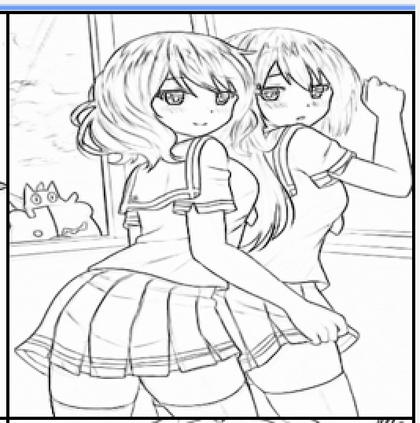
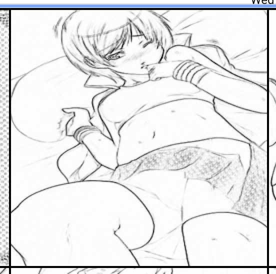
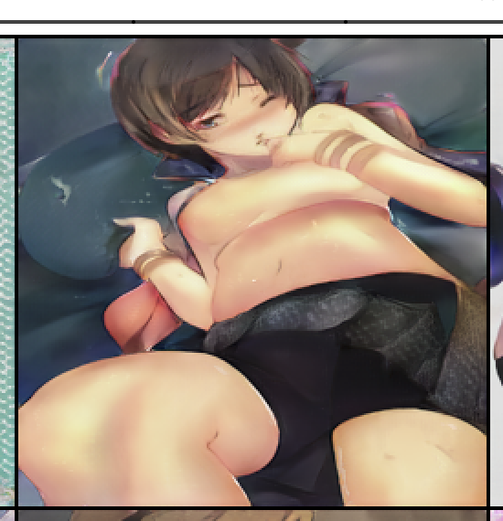

# Style2Paints_V3
Reimplementation of Style2Paints V3 ([https://github.com/lllyasviel/style2paints/blob/master/papers/sa.pdf]())

## Result

<table>
    <tr>
        <td >
figure 1_1  新垣结衣1 
</td>
        <td >
figure 1_2  新垣结衣1 
</td>
    </tr>
    <tr>
    	<td >
figure 2_1  新垣结衣2 
</td>
    	<td >
figure 2_2  新垣结衣2 
</td>
	</tr>
    <tr>
    	<td >
figure 3_1  新垣结衣3 
</td>
    	<td >
figure 3_2  新垣结衣3 
</td>
	</tr>
    <tr>
    	<td >
figure 4_1  新垣结衣4 
</td>
    	<td >
figure 4_2  新垣结衣4 
</td>
	</tr>
    <tr>
    	<td >
figure 5_1  新垣结衣5 
</td>
    	<td >
figure 5_2  新垣结衣5 
</td>
	</tr>
    <tr>
    	<td >
figure 6_1  新垣结衣6 
</td>
    	<td >
figure 6_2  新垣结衣6 
</td>
	</tr>
    <tr>
    	<td >
figure 7_1  新垣结衣7 
</td>
    	<td >
figure 7_2  新垣结衣7 
</td>
	</tr>
    <tr>
    	<td >
figure 8_1  新垣结衣8 
</td>
    	<td >
figure 8_2  新垣结衣8 
</td>
	</tr>
    <tr>
    	<td >
figure 9_1  新垣结衣9 
</td>
    	<td >
figure 9_2  新垣结衣9 
</td>
	</tr>
</table>
## Step1 : Dataset Simulation

