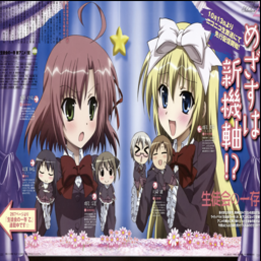
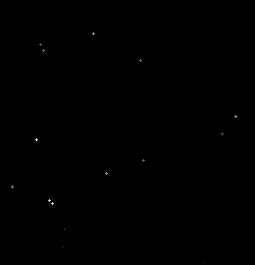
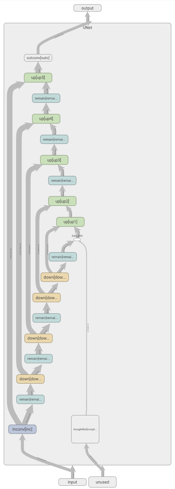

# Style2Paints_V3
Pytorch Reimplementation of Style2Paints V3 ([https://github.com/lllyasviel/style2paints/blob/master/papers/sa.pdf]())

## Results

<table>
    <tr>
        <td ><center>figure 1_1   </center></td>
        <td ><center>figure 1_2   </center></td>
    </tr>
    <tr>
    	<td ><center>figure 2_1   </center></td>
    	<td ><center>figure 2_2   </center></td>
	</tr>
    <tr>
    	<td ><center>figure 3_1   </center></td>
    	<td ><center>figure 3_2   </center></td>
	</tr>
    <tr>
    	<td ><center>figure 4_1   </center></td>
    	<td ><center>figure 4_2   </center></td>
	</tr>
    <tr>
    	<td ><center>figure 5_1   </center></td>
    	<td ><center>figure 5_2   </center></td>
	</tr>
    <tr>
    	<td ><center>figure 6_1   </center></td>
    	<td ><center>figure 6_2   </center></td>
	</tr>
    <tr>
    	<td ><center>figure 7_1   </center></td>
    	<td ><center>figure 7_2   </center></td>
	</tr>
    <tr>
    	<td ><center>figure 8_1   </center></td>
    	<td ><center>figure 8_2   </center></td>
	</tr>
    <tr>
    	<td ><center>figure 9_1   </center></td>
    	<td ><center>figure 9_2   </center></td>
	</tr>
</table>


## Step1 : Dataset Simulation

#### ​	One should modify simulate_step\*.ipynd or simulate_step\*.py with your own data path before runing this script. 

### Simulate_step1 : Random Region Proposal and Pasting

<center></center>

​	See script : simulate_step1.ipynb 

### Simulate_step2 : Random transform

<center>
    
</center>

​	See script : simulate_step2.ipynb 

### Simulate_step3 : Random color spray

<center>
    
</center>

​	I merged this part with the Pytorch data-loader. Refer to ./Pytorch-Style2paints/dataset_multi.py

### Effect Picture

<table>
    <tr>
        <td ><center>Ground truth</center></td>
        <td ><center>Color draft</center></td>
    </tr>
    <tr>
    	<td ><center></center></td>
    	<td ><center></center></td>
	</tr>
    <tr>
    	<td ><center></center></td>
    	<td ><center></center></td>
	</tr>
</table>

## User hints

#### 	I chose [0, 20) user hints from the ground truth randomly, and pasted them on a hint map with 3 channels( RGB while the paper used RGBA )

<table>
    <tr>
        <td ><center>Ground truth</center></td>
        <td ><center>User hints</center></td>
    </tr>
    <tr>
    	<td ><center></center></td>
    	<td ><center></center></td>
	</tr>
    <tr>
    	<td ><center></center></td>
    	<td ><center></center></td>
	</tr>
</table>

## Network structure

<table>
    <td >
        <center></center>		</td>
</table>

## Train 

​	Just run train.py. Don't forget to modify the easydict in the train.py script!

​        All the hyper-parameters are chosen as same as the original paper.

```python
args = easydict.EasyDict({
    'epochs' : 100,
    'batch_size' : 16,
    'train_path' : 'train data path'#'./your train data path/train',
    'val_path' : 'val data path'#'./your val data path/val',
    'sketch_path' : 'sketch path'#"./your sketch data path/sketch",
    'draft_path' : 'STL path'#"./your STL data path/STL",
    'save_path' : 'result path'#"./your save path/results" ,
    'img_size' : 270,
    're_size' : 256,
    'learning_rate' : 1e-5,
    'gpus' : '[0,1,2,3]',
    'lr_steps' : [5, 10, 15, 20],
    "lr_decay" : 0.1,
    'lamda_L1' : 0.01,
    'workers' : 16,
    'weight_decay' : 1e-4
})
```

## Output of the data-loader & I/O of the Model

### Data-loader:

```python
for i, (input, df, gt) in enumerate(train_loader):
```

Input : (batch_size, 4, 256, 256)   :   sketch(1 channel) + hint map(3 channels) 

df : (batch_size, 3, 224, 224)   :   simulated data which is the input of Inception V1

gt: (batch_size, 3, 256, 256)   :   ground truth

### I/O of the Inception V1:

INPUT: df : (batch_size, 3, 224, 224)   :   simulated data which is the input of Inception V1

OUTPUT: latent code (batch_size, 1024, 1, 1)

### I/O of the Style2Paints_V3:

INPUT: Input : (batch_size, 4, 256, 256)   :   sketch(1 channel) + hint map(3 channels) 

OUTPUT: output : (batch_size, 3, 256, 256)   :   colorized manuscripts
